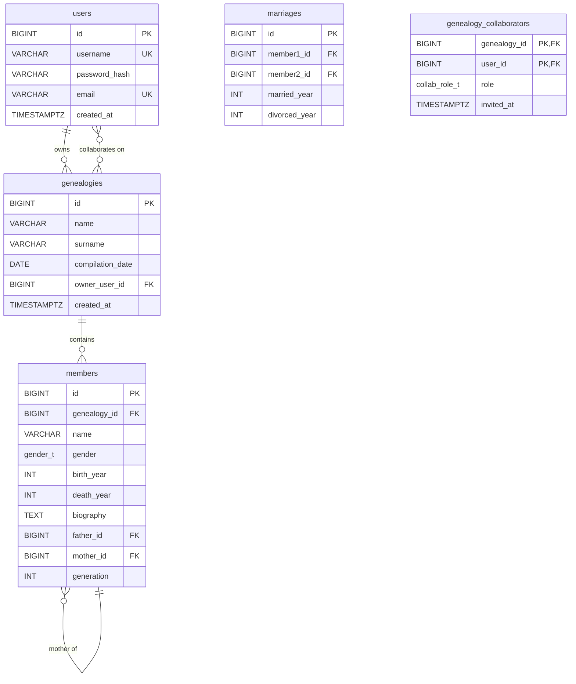

# ER Diagram

## Cardinality summary

| Source | Type | Target | Notes |
|---|---|---|---|
| `users` | 1 : N | `genealogies` | `genealogies.owner_user_id` |
| `users` | M : N | `genealogies` | via `genealogy_collaborators` |
| `genealogies` | 1 : N | `members` | a member belongs to exactly one genealogy |
| `members` | 1 : N | `members` | self-ref via `father_id` (each child has at most one father) |
| `members` | 1 : N | `members` | self-ref via `mother_id` (each child has at most one mother) |
| `members` | M : N | `members` | via `marriages`, with canonical ordering `member1_id < member2_id` |

## Constraint highlights

- Primary keys: surrogate `BIGSERIAL` on every entity (composite for the `genealogy_collaborators` junction).
- Foreign keys: `ON DELETE CASCADE` for ownership chains; parent FKs use `ON DELETE SET NULL` so descendants stay visible if a parent is removed.
- CHECK constraints (single-row): birth-year sanity, death ≥ birth, lifespan ≤ 130, marriage canonical ordering, no self-parent.
- Cross-row constraints (triggers): father/mother must exist with the right gender and same genealogy; parent's birth year must precede child's; `generation` is auto-computed as `1 + max(parent.generation)`.

See [`schema_design.md`](schema_design.md) for the 3NF analysis.
